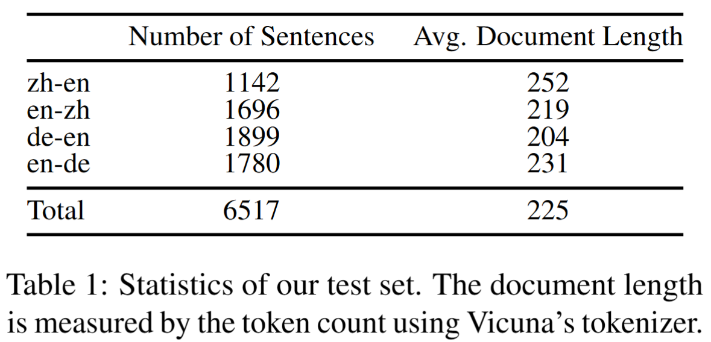
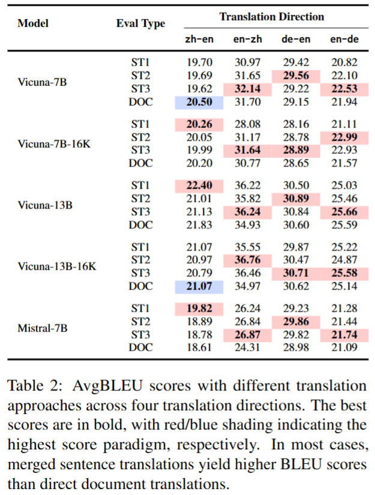
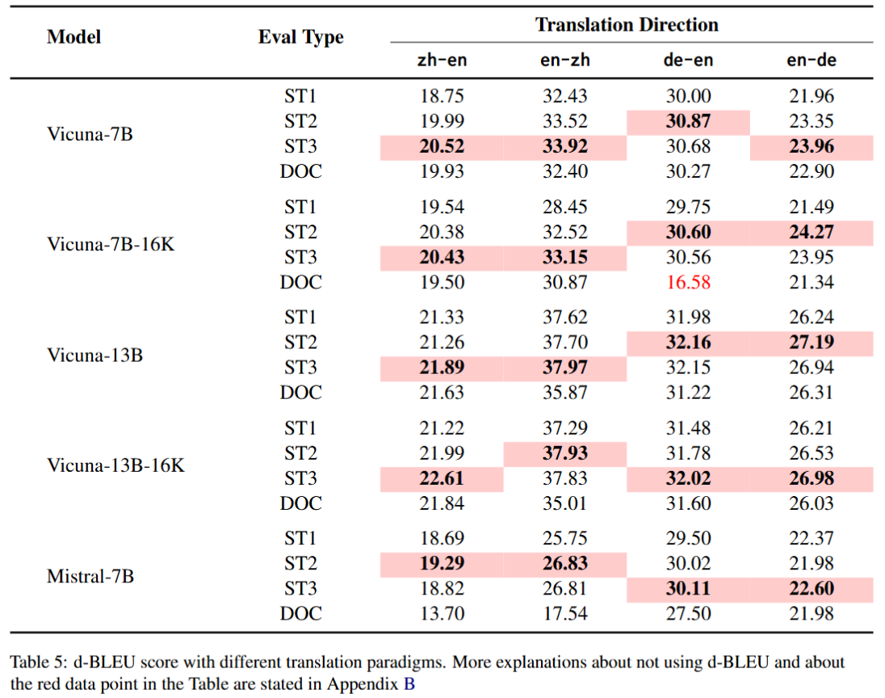

# BLEU-based Evaluation

Datasets and Experimental Results in **BLEU-based Evaluation**.

---

### **Dataset Details**

We use translation benchmarks with document boundaries:  
**WMT22** (zh-en, en-zh, de-en, en-de).

    

---

### Translation Approaches

Given a document containing \( $$l$$ \) source sentences:  
\( $$X = \{x^1, \dots, x^l\}$$ \), the goal of docMT is to generate its translation:  
\( $$Y = \{y^1, \dots, y^l\}$$ \) as a sequence of sentences in the target language.  

In this work, we explore two approaches for generating translations using instruction-tuned LLMs:

1. **ST[k]**  
   Concatenate \( $$k$$ \) source sentences into a chunk, input each chunk into the LLM for translation, and then concatenate the translated chunks together to form the full document translation.

2. **DOC**  
   Instruct the LLM to directly translate the entire document in one pass.

---

### Evaluation Metrics

We argue that documents are generally independent units, so they should be weighted equally in the evaluation. Therefore, we propose an alternative metric, **AvgBLEU**, defined as:

$$
\text{AvgBLEU} = \frac{1}{N} \sum_{i=1}^{N} \text{BLEU}\left(Y_i^{\text{ref}}, Y_i^{\text{pred}}\right)
$$

Where:  
- \( $$N$$ \) is the number of documents.  
- \( $$Y^{\text{ref}}$$ \): Reference document translations.  
- \( $$Y^{\text{pred}}$$ \): Predicted translations.  

This allows us to calculate the average BLEU score (AvgBLEU) for the entire dataset, providing a comprehensive measure of translation quality.  

For completeness, we also report results using the standard d-BLEU metric in [Appendix B: d-BLEU Performance].

---

### Evaluation Results

    

    

