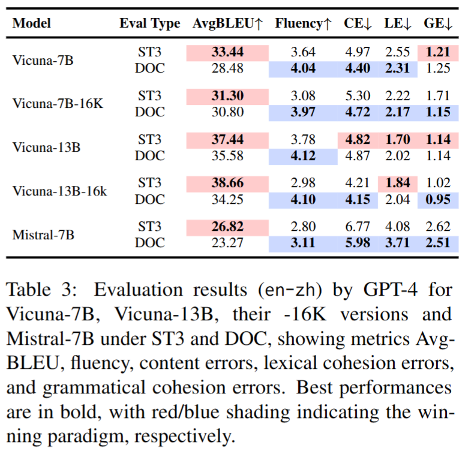
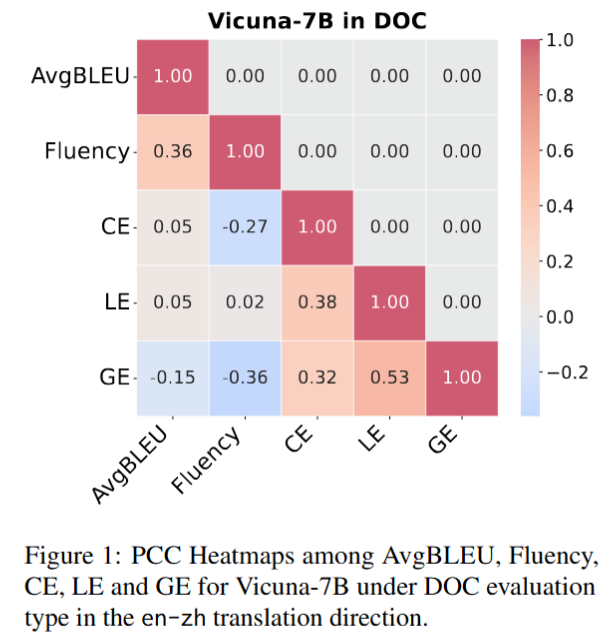

# LLM-as-a-Judge Evaluation

Datasets and Experimental Results in [4 LLM-as-a-judge Evaluation and Appendix D: GPT4-as-a-judge Evaluation Performance].

---

### Evaluation Metrics and Prompts

We design four (sub) metrics:  
1. **Fluency**  
2. Content Errors (**CE**)  
3. Lexical Cohesion Errors (**LE**)  
4. Grammatical Cohesion Errors (**GE**)  

All metrics are measured using prompts provided to GPT-4.  

More details about the metrics can be found in **Appendix C: GPT4-as-a-judge Evaluation Prompts** and the prompts are available [here](evaluation_instructions.md).

---

### Evaluation Results

We use GPT-4 to evaluate five models under **ST3** and **DOC** settings using our metrics. The results show that **DOC** generally outperforms **ST3**, but traditional BLEU-based metrics fail to capture this improvement.  

Overall, our approach enables a more detailed evaluation of translation quality in DocMT. It highlights that instruction-tuned LLMs, even without fine-tuning for document-level MT tasks, effectively capture long-context information for DocMT.  

More detailed results can be found in **[Appendix D: GPT4-as-a-judge Evaluation Performance]**.

    

To gain a deeper understanding of how these metrics correlate with each other, we compute the **Pearson Correlation Coefficients (PCC)** among the metrics and visualize them. More detailed results can be found in **[Appendix E: Correlation Visualizations]**.

    

