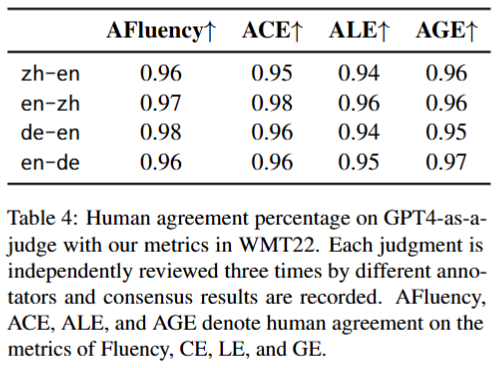
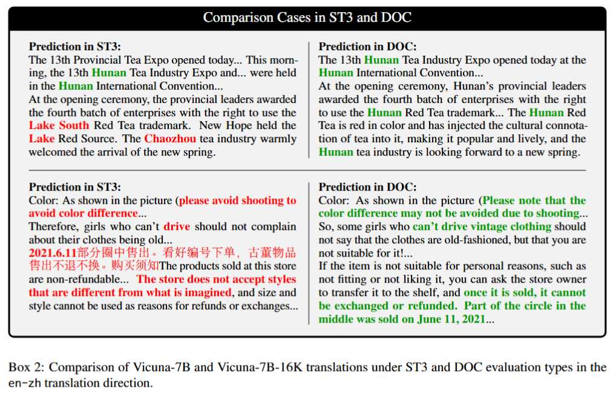

# LLM-as-a-Judge Evaluation

### Human Agreement

To validate the alignment between our LLM-as-a-judge paradigm and human evaluations, we conducted experiments to assess agreement. For each model in both ST3 and DOC, we used 10 samples per translation direction and asked human evaluators to respond with a simple ‘yes’ or ‘no’ regarding their agreement with the LLM-as-a-judge’s assessments according to our metrics.

    

### Case Study

While ST3 translations may achieve higher AvgBLEU scores than DOC, we find that DOC translations result in more fluent, readable, and cohesive output. We present two pairs of samples from Vicuna-7B and Vicuna-7B-16K(zh-en), covering beginning, middle, and end of each sample.

    

